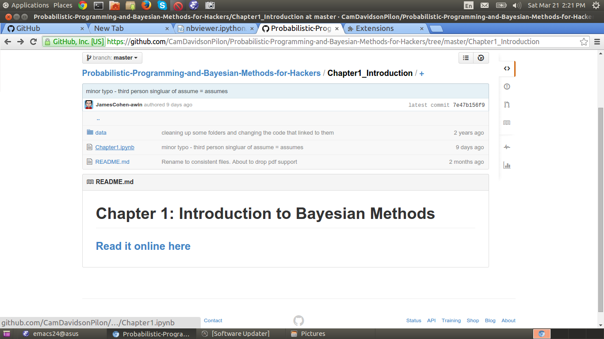
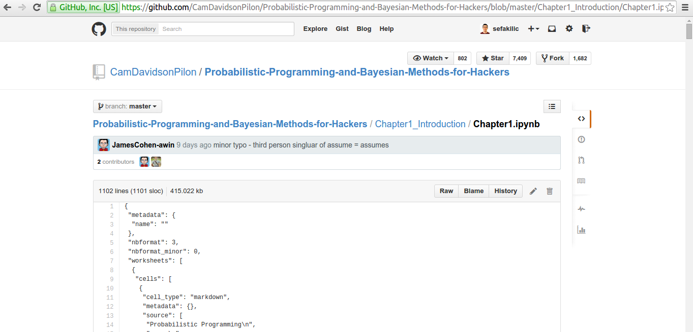
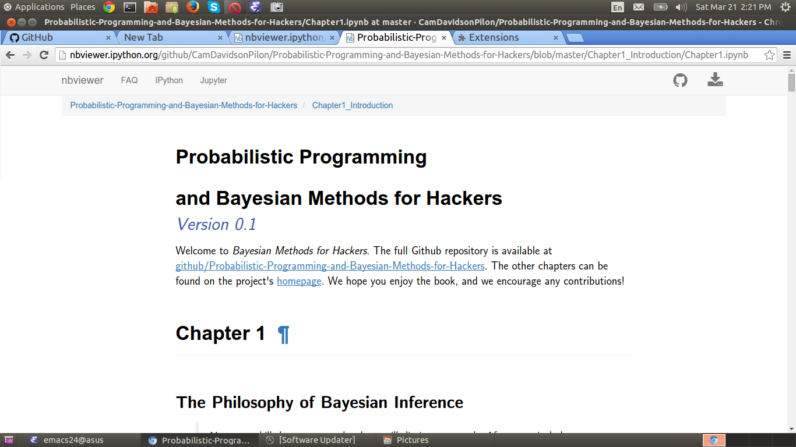

# nbviewerviewer

A Google Chrome extension to view IPython notebooks from GitHub. When browsed a
IPython notebook file (i.e., files ending with `.ipynb`), this extension
redirects you to the [nbviewer](http://nbviewer.ipython.org) to view the notebook
properly, rather than raw format what GitHub does.

## Example

When you are browsing a project in GitHub,

instead of the raw IPython notebook file

you would see this

